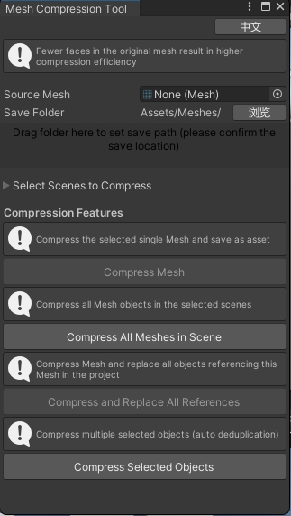
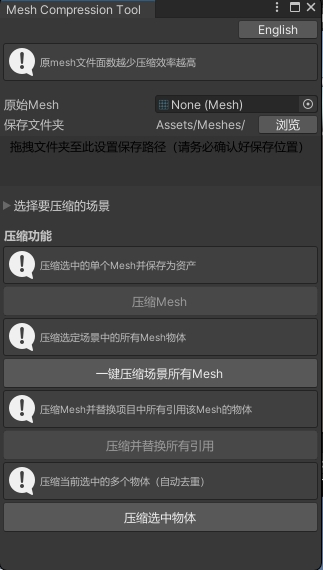
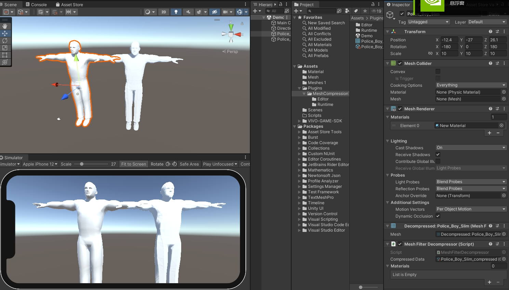
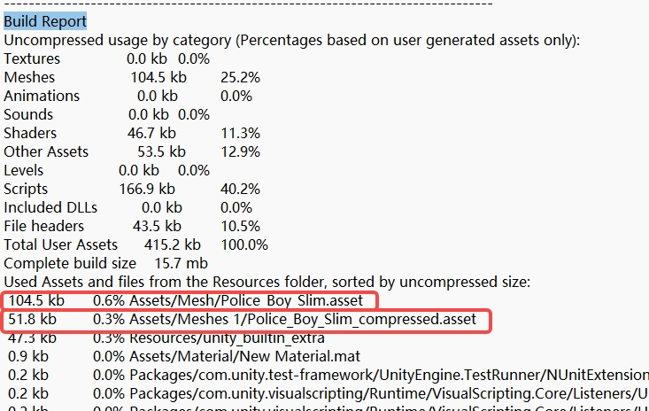

# Mesh压缩工具使用说明
# Mesh Compression Tool User Guide

## 目录 / Table of Contents
1. [工具简介 / Introduction](#1-工具简介--introduction)
2. [功能概述 / Features](#2-功能概述--features)
3. [安装与打开 / Installation & Opening](#3-安装与打开--installation--opening)
4. [使用教程 / Tutorial](#4-使用教程--tutorial)
   - [4.1 压缩单个网格 / Compress a Single Mesh](#41-压缩单个网格--compress-a-single-mesh)
   - [4.2 批量压缩场景中的网格 / Batch Compress Meshes in Scenes](#42-批量压缩场景中的网格--batch-compress-meshes-in-scenes)
   - [4.3 压缩并替换所有引用 / Compress and Replace All References](#43-压缩并替换所有引用--compress-and-replace-all-references)
   - [4.4 压缩选中物体 / Compress Selected Objects](#44-压缩选中物体--compress-selected-objects)
5. [压缩效果示例 / Compression Examples](#5-压缩效果示例--compression-examples)
6. [注意事项 / Notes](#6-注意事项--notes)
7. [常见问题 / FAQ](#7-常见问题--faq)

---

## 1. 工具简介 / Introduction

本工具是一个用于在Unity编辑器中压缩3D网格（Mesh）的插件，改变存储方式，显著减少内存和存储占用。压缩后的网格可在运行时动态解压，适用于对内存敏感的平台（如移动端、WebGL）。

This tool is a plugin used to compress 3D meshes in the Unity editor, changing the storage method and significantly reducing memory and storage usage. The compressed grid can be dynamically decompressed at runtime, suitable for memory sensitive platforms such as mobile devices and WebGL.

## 2. 功能概述 / Features

- ✅ 压缩单个网格并保存为资产
- ✅ 批量压缩场景中所有网格
- ✅ 压缩并自动替换所有引用（场景、预制体）
- ✅ 压缩选中物体引用的所有网格
- ✅ 中英文界面切换
- ✅ 实时显示压缩率和大小对比

- ✅ Compress single mesh and save as asset
- ✅ Batch compress all meshes in scenes
- ✅ Compress and automatically replace all references (scenes, prefabs)
- ✅ Compress all meshes referenced by selected objects
- ✅ Chinese/English UI switch
- ✅ Real-time compression ratio and size comparison

## 3. 安装与打开 / Installation & Opening

### 安装 / Installation
将提供的C#脚本放入项目的`Editor`文件夹中（如`Assets/Editor/MeshCompression/`）。

Place the provided C# scripts in an `Editor` folder (e.g., `Assets/Editor/MeshCompression/`).

### 打开工具窗口 / Open the Tool Window
在Unity编辑器中点击菜单栏：
**Tools > Mesh Compression Tool**
或
**工具 > Mesh压缩工具**

In Unity Editor, go to:
**Tools > Mesh Compression Tool**

## 4. 使用教程 / Tutorial

### 4.1 压缩单个网格 / Compress a Single Mesh

1. 在窗口中选择要压缩的Mesh
2. 设置保存路径（支持拖拽文件夹）
3. 点击【压缩Mesh】按钮
4. 查看压缩结果并确认保存

1. Select a Mesh to compress
2. Set the save path (drag folder supported)
3. Click【Compress Mesh】
4. Check the result and confirm

### 4.2 批量压缩场景中的网格 / Batch Compress Meshes in Scenes

1. 展开【选择要压缩的场景】区域
2. 拖入场景文件或使用当前打开的场景
3. 点击【一键压缩场景所有Mesh】
4. 等待处理完成，查看压缩统计

1. Expand【Select Scenes to Compress】
2. Drag in scene files or use currently open scenes
3. Click【Compress All Meshes in Scene】
4. Wait for processing and check the result

### 4.3 压缩并替换所有引用 / Compress and Replace All References

1. 选择一个Mesh
2. 点击【压缩并替换所有引用】
3. 确认提示框
4. 工具将自动替换所有使用该Mesh的场景和预制体

1. Select a Mesh
2. Click【Compress and Replace All References】
3. Confirm the dialog
4. The tool will replace all references in scenes and prefabs

### 4.4 压缩选中物体 / Compress Selected Objects

1. 在场景中选择一个或多个带有Mesh的物体
2. 点击【压缩选中物体】
3. 确认提示框
4. 工具将压缩这些物体引用的所有Mesh并替换引用

1. Select one or more objects with Meshes in the scene
2. Click【Compress Selected Objects】
3. Confirm the dialog
4. The tool will compress all referenced Meshes and replace them

## 5. 压缩效果示例 / Compression Examples

### 示例1：工具界面 / Example 1: Tool Window
下图展示了Mesh压缩工具的主界面，您可以选择Mesh、设置保存路径并执行压缩操作。

The following image shows the main interface of the Mesh Compression Tool, where you can select a Mesh, set the save path, and perform compression.

### 示例2：构建报告 / Example 2: Build Report
下图展示了使用网格压缩后的构建报告，可以看到网格资产的大小显著减少。

The following image shows a build report after using mesh compression. Note the significant reduction in the size of mesh assets.

## 6. 注意事项 / Notes

- 🔸 压缩后的网格会在运行时解压，可能会轻微增加CPU开销
- 🔸 建议在发布前进行测试，确保视觉和碰撞行为正常
- 🔸 不支持SkinnedMeshRenderer和动态生成的网格
- 🔸 构建前会自动清理临时网格，避免包含在构建中

- 🔸 Compressed meshes are decompressed at runtime, which may slightly increase CPU usage
- 🔸 Test before publishing to ensure visual and collision behavior is correct
- 🔸 SkinnedMeshRenderer and dynamically generated meshes are not supported
- 🔸 Temporary meshes are automatically cleaned before building to avoid inclusion in the build

## 7. 常见问题 / FAQ

**Q: 压缩后的网格会丢失精度吗？**
A: 是的，可能轻微影响视觉效果，通常不易察觉。

**Q: 能否撤销压缩操作？**
A: 不能自动撤销，请提前备份项目。

**Q: Will compressed meshes lose precision?**
A: Yes, which may slightly affect visual quality, usually not noticeable.

**Q: Can I undo compression?**
A: No automatic undo is provided; please backup your project before operation.

---

## 支持与反馈 / Support & Feedback

如果您在使用过程中遇到问题或有改进建议，请联系开发团队。

If you encounter any issues or have suggestions for improvement, please contact the development team.

**版本: 1.0.0** | **更新日期: 2023-11-15**
